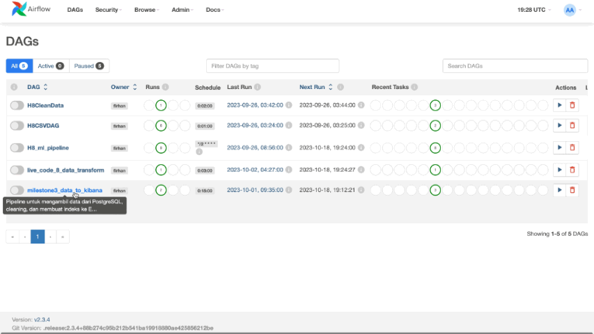
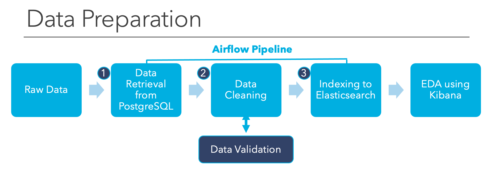
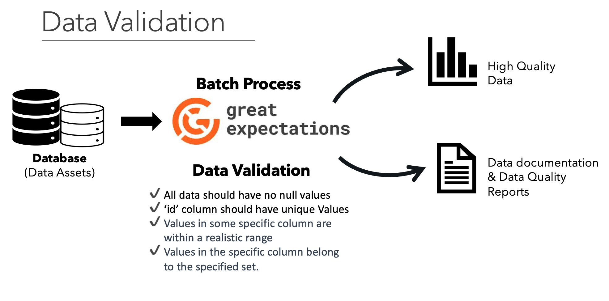
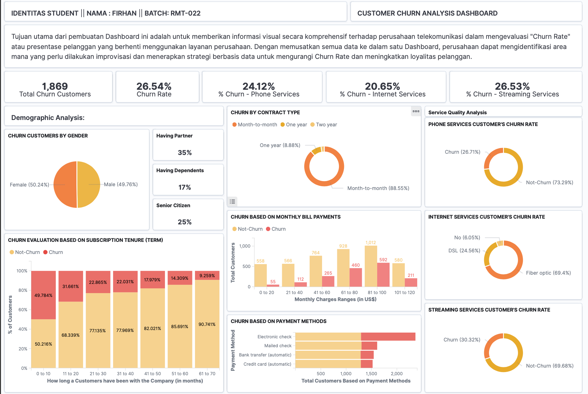

# Automated Data Pipeline for Telco Churn Analysis Using Airflow & Docker	

## Table of Contents

- [Project Overview](#project-overview)
- [Data Sources](#data-sources)
- [Airflow Pipeline](#airflow-pipeline)
- [Customer Churn Analysis Dashboard](#customer-churn-analysis-dashboard)

### Project Overview
---
Developed and automated a data processing pipeline using Apache Airflow, configured within a Docker environment, for the Telco Customer Churn dataset from Kaggle. This pipeline streamlined data extraction from a PostgreSQL database, performed essential cleaning, and integrated the data into Elasticsearch for enhanced data exploration and visualization with Kibana. Additionally, implemented data validation using the Great Expectations library to ensure data quality and consistency throughout the workflow.

### Data Sources

The dataset used is data available on the Kaggle website, a dataset called *Telco Customer Churn* which contains information about transaction data and customer profiles from a telecommunications company domiciled in the United States. This data was obtained under license from the Kaggle website with the following [link](https://www.kaggle.com/datasets/blastchar/telco-customer-churn?datasetId=13996&sortBy=voteCount)

### Tools

- Airflow: for orchestrating the entire workflow.
- pandas: for data manipulation and cleaning.
- PostgreSQL: is used as the primary data storage and retrieval system for the dataset.
- Docker: provides a portable environment in which the data processing pipeline, Airflow operates.
- Great Expectations: a Python-based data validation and data profiling library. 
- sqlalchemy: for extracting data from the PostgreSQL database.
- elasticsearch: for integrating the cleaned data into Elasticsearch, making it ready for visualization with Kibana.

### Airflow Pipeline

In the data preparation phase, I performed the following tasks:
1. Data Retrieval from PostgreSQL: The function is defined to retrieve data from a PostgreSQL database.
    - It connects to the PostgreSQL database to fetch data from a specific table and return it as a DataFrame. 
    - Fetch data from a specific PostgreSQL table running in a Docker container.
2. Data Cleaning: Removes duplicate rows, adjusting data types, correcting incorrect data, transforming column names, and handling missing values.
3. Indexing to Elasticsearch: The is designed to index cleaned data to an Elasticsearch instance.
    - Establishes a connection to Elasticsearch running on Docker. 
    - The function then utilizes to index the cleaned data to a specific Elasticsearch index name.

### Data Validation
- After data cleaning process, the cleaned data has also been validated using Great Expectation. 
- The given validation process is done with Great Expectations, a Python-based data validation and data profiling library. 
- The primary function of Data validation is to set up a series of data quality checks or "Expectations" on a given data batch, ensuring that the data meets certain criteria or standards before it's used in subsequent analysis or processing. 
- The expectation that are used is: For example in this case, id’ column should have unique Values. This could be important for ensuring that each customer is represented only once.

### Customer Churn Analysis Dashboard

The analysis results are summarized as follows:
1. About a quarter of the Customers have been leaving this telecommunication company, which is very bad rate. 
2. A majority of the telco customers are subscribed to a telephone service, with almost 27% of them churning.
3. Majority the customers who leave the company have been with the company for less than a year or can be considered as new customers.
4. Most customers who churn are on a monthly contract. Additionally, customers with higher monthly charges are more likely to churn.
5. The highest churn rate is among Fiber optic service users. This suggests that there may be issues with the fiber optic service, and churn is likely to increase among its subscribers.

### Recommendations

Based on the analysis, I recommend the following actions:
- Customer Retention Focus: With about a quarter of the customers leaving, it's vital to launch a targeted customer retention program. This could involve loyalty benefits, personalized offers, or enhanced customer service support to address concerns and enhance the overall customer experience.
- Investigate Short-term Customers: Since half of the customers who leave have been with the company for less than a year, it's crucial to investigate the primary pain points for new customers. Implement feedback mechanisms for new customers to understand their expectations. 
- Re-evaluate Monthly Contract Strategy: The high churn among monthly contract customers indicates potential dissatisfaction with the terms or perceived value. Consider revising the monthly contract offerings, providing incentives for longer-term contracts, or improving the clarity and communication around monthly contract benefits.
- Pricing Strategy Assessment: The data suggests customers with higher monthly charges are more likely to churn. It may be beneficial to reassess the pricing strategy, possibly introducing more competitive pricing tiers or bundling options that offer better perceived value to customers.
- Fiber Optic Service Review: The significant churn among fiber optic service users is concerning. It's essential to conduct a thorough review of the fiber optic service. This should include service reliability, speed consistency, customer support for this specific service, and competitive pricing compared to alternatives in the market. Feedback from churned customers can provide invaluable insights into the specific issues they faced.

### References

1. [Airflow Documentation](https://airflow.apache.org/docs/apache-airflow/stable/index.html)
2. [Great Expectation Guide](https://docs.greatexpectations.io/docs/)
3. [Docker Manual](https://docs.docker.com/desktop/)
4. [Elasticsearch Documentation](https://www.elastic.co/guide/index.html?utm_campaign=B-Stack-Trials-APJ-Exact&utm_content=Stack-Documentation&utm_source=google&utm_medium=cpc&device=c&utm_term=elasticsearch%20documentation&gclid=Cj0KCQjwhL6pBhDjARIsAGx8D59FqTjkMeFbTdlfRVDDhDxDDYiPfx0qIIRX9EkaEbTSNdwx_c8BeD4aAhiyEALw_wcB)
5. [Kaggle](https://www.kaggle.com/datasets/blastchar/telco-customer-churn)

